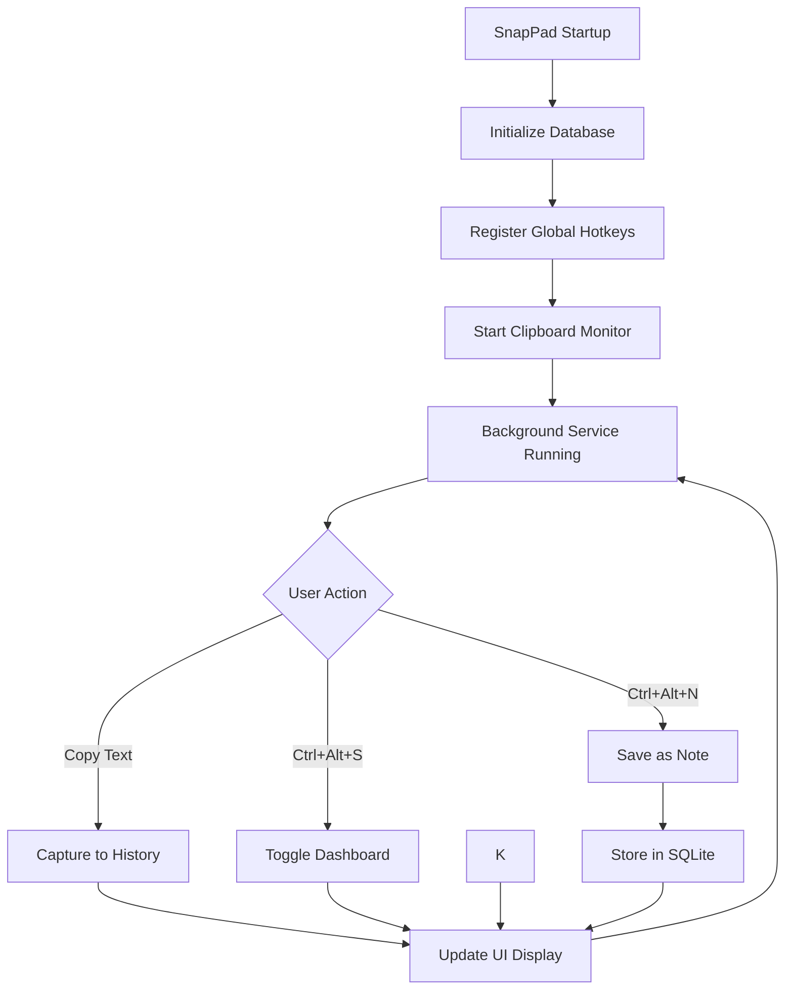

# SnapPad 📋

[](https://www.python.org/downloads/)
[](https://pypi.org/project/PyQt6/)
[](https://www.microsoft.com/en-us/windows)

> A lightweight, always-on-top Windows application for managing clipboard history and persistent notes with global hotkeys.

## 🎯 Purpose

SnapPad is designed to solve the common problem of losing clipboard content and managing quick notes efficiently. It runs silently in the background, capturing your clipboard history and providing instant access to your notes through customizable global hotkeys. Perfect for developers, writers, and power users who frequently copy/paste content and need quick note-taking capabilities.

 
 

 
## ✨ Key Features

- **🚀 Background Service**: Runs silently with minimal resource usage (~10MB RAM)
- **📋 Smart Clipboard History**: Automatically tracks last 10 unique copied items
- **📝 Persistent Notes**: SQLite-backed notes that survive application restarts
- **🤖 AI Prompt Enhancement**: OpenAI-powered prompt improvement for better AI interactions
- **🧠 AI Smart Response**: Generate intelligent responses to questions, code, or any text input
- **⌨️ Global Hotkeys**: System-wide shortcuts for instant access (`Ctrl+Alt+S`, `Ctrl+Alt+N`, `Ctrl+Alt+R`)
- **🖥️ Always-on-Top Dashboard**: Modern UI positioned on screen edge for quick access

## 🏗️ Technical Stack

- **Core Language**: Python 3.7+
- **GUI Framework**: PyQt6 (modern Qt6 bindings)
- **Database**: SQLite (lightweight, file-based)
- **Clipboard Management**: pyperclip (cross-platform clipboard access)
- **Global Hotkeys**: keyboard library (system-wide key capture)
- **AI Integration**: OpenAI API (GPT models for prompt enhancement)
- **Windows Integration**: pywin32 (system tray, Windows APIs)
- **Platform**: Windows 10/11 

## 🔄 Application Flow



### How It Works

1. **Startup**: Application initializes SQLite database and registers with Windows system tray
2. **Monitoring**: Continuous background thread monitors clipboard changes every 500ms
3. **Capture**: When new content is copied, it's added to history (duplicates removed)
4. **Storage**: Notes are permanently stored in SQLite database at `%APPDATA%\SnapPad\snappad.db`
5. **Access**: Global hotkeys provide instant access without switching applications
6. **UI**: Modern PyQt6 dashboard displays on-demand, always stays on top

## 📦 Installation & Setup

### Option 1: Quick Install (Recommended)

```bash
# 1. Clone the repository
git clone https://github.com/shakedshoshan/SnapPad.git
cd snappad

# 2. Run the installer (handles everything automatically)
install.bat
```

### Option 2: Manual Installation

```bash
# 1. Ensure Python 3.7+ is installed
python --version

# 2. Install dependencies
pip install -r requirements.txt

# 3. Run the application
python main.py
```


## 🚀 Usage

### Starting the Application

- **Command Line**: `python main.py`
- **Batch File**: Double-click `SnapPad.bat` for quick start

### Default Controls

| Action | Hotkey | Description |
|--------|--------|-------------|
| Toggle Dashboard | `Ctrl + Alt + S` | Show/hide the main interface |
| Save Note | `Ctrl + Alt + N` | Save current clipboard as note |
| Enhance Prompt | `Ctrl + Alt + E` | Enhance clipboard content as prompt |
| Exit | `Ctrl + C` |

### AI Prompt Enhancement

To use the new AI prompt enhancement feature:

1. **Setup**: Follow the guide in `OPENAI_SETUP.md` to configure your OpenAI API key
2. **Enhance**: Paste any prompt in the input field and click "Enhance Prompt"
3. **Copy**: Use the enhanced version or click "Copy Enhanced" to copy to clipboard

**Example:**
- **Input**: "write a story about a cat"
- **Enhanced**: "Write a compelling short story about a cat with engaging characters, vivid descriptions, and a clear plot structure..."

### AI Smart Response Generation

The new AI Smart Response feature allows you to generate intelligent responses to questions, code snippets, or any text input using OpenAI's GPT models.

**How to use:**
1. **Setup**: Ensure OpenAI API is configured (same as prompt enhancement)
2. **Select Type**: Choose from 7 different response types (General, Educational, Code, Creative, etc.)
3. **Input**: Enter your question, code, or prompt in the input field
4. **Generate**: Click "Generate Response" to get an AI-powered response
5. **Copy**: Use the generated response or copy it to clipboard

**Response Types:**
- **General**: Helpful responses to general questions
- **Educational**: Detailed explanations for learning
- **Code**: Code review and improvement suggestions
- **Creative**: Creative writing and brainstorming
- **Analytical**: Logical analysis and breakdowns
- **Step-by-Step**: Detailed instructions and solutions
- **Fun**: Engaging and entertaining responses

**Hotkey**: `Ctrl+Alt+R` - Generate smart response from selected text

**Example:**
- **Input**: "What is recursion in programming?"
- **Response Type**: Educational
- **Output**: "Recursion is a programming concept where a function calls itself..."

### Features Overview

#### 📋 Clipboard History
- Automatically captures all text copied to clipboard
- Displays last 10 unique items (configurable)
- Click any item to copy it back to clipboard
- Duplicates are automatically removed

#### 📝 Notes Management
- Add new notes directly in the dashboard
- Edit existing notes with inline editing
- Delete notes with confirmation
- All notes persist between application sessions

#### 🤖 AI Prompt Enhancement
- Paste any prompt and get an AI-enhanced version
- Uses OpenAI's GPT models for intelligent improvement
- Configurable model selection (GPT-4, GPT-3.5-turbo)
- Automatic clipboard copying of enhanced prompts
- Connection testing and error handling

#### 🧠 AI Smart Response Generation
- Generate intelligent responses to questions, code, or any text input
- 7 different response types (General, Educational, Code, Creative, etc.)
- Uses OpenAI's GPT models for context-aware responses
- Automatic clipboard copying and text replacement
- Global hotkey support (`Ctrl+Alt+R`) for quick access

## ⚙️ Configuration

### Initial Setup

1. **Copy the template**: Copy `config_template.py` to `config.py`
2. **Configure API Key**: Add your OpenAI API key to use AI features
3. **Customize Settings**: Adjust other settings as needed

```bash
# Copy the configuration template
cp config_template.py config.py
```

### OpenAI API Setup

To use the AI prompt enhancement feature:

1. Get an API key from [OpenAI](https://platform.openai.com/api-keys)
2. Add it to `config.py`:
   ```python
   OPENAI_API_KEY = "your-api-key-here"
   ```
3. Or set it as an environment variable:
   ```bash
   set OPENAI_API_KEY=your-api-key-here
   ```

### Customization Options

Edit `config.py` to customize behavior:

```python
# Clipboard Settings
CLIPBOARD_HISTORY_SIZE = 10          # Number of items to remember
CLIPBOARD_MONITOR_INTERVAL = 0.5     # Check interval in seconds

# Hotkey Settings  
HOTKEY_TOGGLE_DASHBOARD = "ctrl+alt+s"  # Show/hide dashboard
HOTKEY_SAVE_NOTE = "ctrl+alt+n"         # Save clipboard as note
HOTKEY_ENHANCE_PROMPT = "ctrl+alt+e"    # Enhance prompt
HOTKEY_SMART_RESPONSE = "ctrl+alt+r"    # Generate smart response

# Dashboard Settings
DASHBOARD_WIDTH = 360                # Window width in pixels
DASHBOARD_HEIGHT = 680               # Window height in pixels
DASHBOARD_ALWAYS_ON_TOP = True       # Keep above other windows

# OpenAI Settings
OPENAI_MODEL = "gpt-4"               # Model to use for enhancement
OPENAI_MAX_TOKENS = 1500             # Maximum response length
OPENAI_TEMPERATURE = 0.7             # Creativity level (0.0-1.0)

# Performance
REFRESH_INTERVAL = 500               # UI refresh rate in milliseconds
```

## 📁 Project Structure

```
SnapPad/
├── main.py                 # Application entry point & orchestration
├── config.py              # Configuration settings & constants
├── database.py            # SQLite operations & data models
├── clipboard_manager.py   # Clipboard monitoring & history management
├── hotkey_manager.py      # Global hotkey registration & handling
├── openai_manager.py      # OpenAI API integration & AI features
├── dashboard.py           # PyQt6 user interface & window management
├── requirements.txt       # Python dependencies
├── install.bat            # Automated installer & launcher
├── SnapPad.bat            # Quick launcher
├── OPENAI_SETUP.md        # OpenAI feature setup guide
└── SnapPad_icon.png       # Application icon
```


## 🤝 Contributing

Contributions are welcome! Please:

1. Fork the repository
2. Create a feature branch: `git checkout -b feature-name`
3. Make your changes with proper commit messages
4. Add tests if applicable
5. Submit a pull request with a clear description

## 📄 License

This project is licensed under the MIT License - see the [LICENSE](LICENSE) file for details.

## 🐛 Issues & Support

- **Bug Reports**: [Create an issue](https://github.com/yourusername/snappad/issues) with reproduction steps
- **Feature Requests**: [Create an issue](https://github.com/yourusername/snappad/issues) with detailed description
- **Questions**: Check existing issues or create a new one

## 🎯 Roadmap

- [x] AI Prompt Enhancement (OpenAI integration)
- [x] AI Smart Response Generation (OpenAI integration)
- [ ] Rich text notes support
- [ ] Note categories and tagging
- [ ] Search functionality
- [ ] Cloud synchronization
- [ ] Custom themes & dark mode
- [ ] Multi-language support
- [ ] File attachment support

---

<div align="center">
<strong>Made with ❤️ for productivity enthusiasts</strong><br>
<sub>Star ⭐ this repo if you find it useful!</sub>
</div> 
