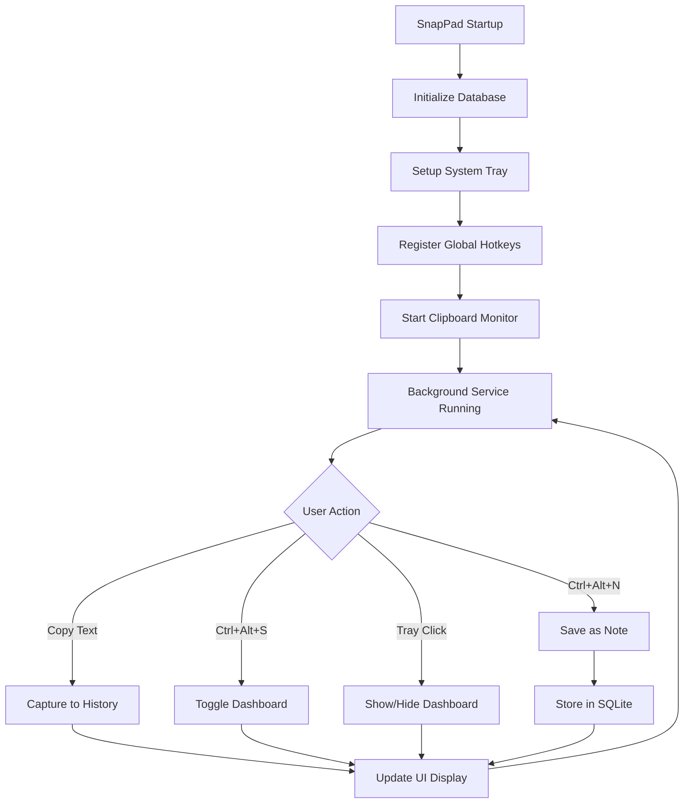

# SnapPad 📋

[](https://www.python.org/downloads/)
[](https://pypi.org/project/PyQt6/)
[](LICENSE)
[](https://www.microsoft.com/en-us/windows)

> A lightweight, always-on-top Windows application for managing clipboard history and persistent notes with global hotkeys.

## 🎯 Purpose

SnapPad is designed to solve the common problem of losing clipboard content and managing quick notes efficiently. It runs silently in the background, capturing your clipboard history and providing instant access to your notes through customizable global hotkeys. Perfect for developers, writers, and power users who frequently copy/paste content and need quick note-taking capabilities.

  
## ✨ Key Features

- **🚀 Background Service**: Runs silently with minimal resource usage (~10MB RAM)
- **📋 Smart Clipboard History**: Automatically tracks last 10 unique copied items
- **📝 Persistent Notes**: SQLite-backed notes that survive application restarts
- **⌨️ Global Hotkeys**: System-wide shortcuts for instant access (`Ctrl+Alt+S`, `Ctrl+Alt+N`)
- **🖥️ Always-on-Top Dashboard**: Modern UI positioned on screen edge for quick access
- **🔧 System Tray Integration**: Minimizes to tray with right-click context menu
- **⚙️ Fully Configurable**: Customize hotkeys, UI dimensions, and behavior

## 🏗️ Technical Stack

- **Core Language**: Python 3.7+
- **GUI Framework**: PyQt6 (modern Qt6 bindings)
- **Database**: SQLite (lightweight, file-based)
- **Clipboard Management**: pyperclip (cross-platform clipboard access)
- **Global Hotkeys**: keyboard library (system-wide key capture)
- **Windows Integration**: pywin32 (system tray, Windows APIs)
- **Platform**: Windows 10/11 (with Docker support for Linux/macOS)

## 🔄 Application Flow



### How It Works

1. **Startup**: Application initializes SQLite database and registers with Windows system tray
2. **Monitoring**: Continuous background thread monitors clipboard changes every 500ms
3. **Capture**: When new content is copied, it's added to history (duplicates removed)
4. **Storage**: Notes are permanently stored in SQLite database at `%APPDATA%\SnapPad\snappad.db`
5. **Access**: Global hotkeys provide instant access without switching applications
6. **UI**: Modern PyQt6 dashboard displays on-demand, always stays on top

## 📦 Installation & Setup

### Option 1: Quick Install (Recommended)

```bash
# 1. Clone the repository
git clone https://github.com/yourusername/snappad.git
cd snappad

# 2. Run the installer (handles everything automatically)
install.bat
```

### Option 2: Manual Installation

```bash
# 1. Ensure Python 3.7+ is installed
python --version

# 2. Install dependencies
pip install -r requirements.txt

# 3. Run the application
python main.py
```


## 🚀 Usage

### Starting the Application

- **Command Line**: `python main.py`
- **Batch File**: Double-click `SnapPad.bat` for quick start

### Default Controls

| Action | Hotkey | Description |
|--------|--------|-------------|
| Toggle Dashboard | `Ctrl + Alt + S` | Show/hide the main interface |
| Save Note | `Ctrl + Alt + N` | Save current clipboard as note |
| Exit | `Ctrl + C` |


### Features Overview

#### 📋 Clipboard History
- Automatically captures all text copied to clipboard
- Displays last 10 unique items (configurable)
- Click any item to copy it back to clipboard
- Duplicates are automatically removed

#### 📝 Notes Management
- Add new notes directly in the dashboard
- Edit existing notes with inline editing
- Delete notes with confirmation
- All notes persist between application sessions

#### 🔧 System Tray
Right-click the tray icon for:
- Show/Hide Dashboard
- Clear Clipboard History  
- About Information
- Exit Application

## ⚙️ Configuration

Customize behavior by editing `config.py`:

```python
# Clipboard Settings
CLIPBOARD_HISTORY_SIZE = 10          # Number of items to remember
CLIPBOARD_MONITOR_INTERVAL = 0.5     # Check interval in seconds

# Hotkey Settings  
HOTKEY_TOGGLE_DASHBOARD = "ctrl+alt+s"  # Show/hide dashboard
HOTKEY_SAVE_NOTE = "ctrl+alt+n"         # Save clipboard as note

# Dashboard Settings
DASHBOARD_WIDTH = 360                # Window width in pixels
DASHBOARD_HEIGHT = 580               # Window height in pixels
DASHBOARD_ALWAYS_ON_TOP = True       # Keep above other windows

# Performance
REFRESH_INTERVAL = 500               # UI refresh rate in milliseconds
```

## 📁 Project Structure

```
SnapPad/
├── main.py                 # Application entry point & orchestration
├── config.py              # Configuration settings & constants
├── database.py            # SQLite operations & data models
├── clipboard_manager.py   # Clipboard monitoring & history management
├── hotkey_manager.py      # Global hotkey registration & handling
├── dashboard.py           # PyQt6 user interface & window management
├── requirements.txt       # Python dependencies
├── install.bat            # Automated installer & launcher
├── SnapPad.bat            # Quick launcher
└── SnapPad_icon.png       # Application icon
```

## 🛠️ Development Setup

```bash
# 1. Clone and setup development environment
git clone https://github.com/yourusername/snappad.git
cd snappad

# 2. Create virtual environment (recommended)
python -m venv venv
venv\Scripts\activate  # Windows
# source venv/bin/activate  # Linux/macOS

# 3. Install dependencies
pip install -r requirements.txt

# 4. Run in development mode
python main.py
```

## 🧪 Testing

Basic functionality test:

```bash
# 1. Start the application
python main.py

# 2. Verify system tray icon appears
# 3. Test hotkeys: Ctrl+Alt+S (dashboard), Ctrl+Alt+N (save note)
# 4. Copy text and verify it appears in clipboard history
# 5. Add a note and restart app to verify persistence
```

## 🔧 Auto-Start Setup

To run SnapPad automatically on Windows startup:

1. Create a shortcut to `SnapPad.bat`
2. Open startup folder: `Win + R` → `shell:startup` → Enter
3. Copy the shortcut to this folder
4. Restart to test

## 🐳 Docker Support

SnapPad includes full Docker support for cross-platform compatibility:

- **GUI Support**: Complete PyQt6 interface with X11 forwarding
- **Clipboard Integration**: Cross-platform clipboard access
- **Persistent Data**: Notes and settings preserved between runs
- **Auto-restart**: Container restarts on failure

See [Docker documentation](DOCKER.md) for detailed setup instructions.

## 🤝 Contributing

Contributions are welcome! Please:

1. Fork the repository
2. Create a feature branch: `git checkout -b feature-name`
3. Make your changes with proper commit messages
4. Add tests if applicable
5. Submit a pull request with a clear description

## 📄 License

This project is licensed under the MIT License - see the [LICENSE](LICENSE) file for details.

## 🐛 Issues & Support

- **Bug Reports**: [Create an issue](https://github.com/yourusername/snappad/issues) with reproduction steps
- **Feature Requests**: [Create an issue](https://github.com/yourusername/snappad/issues) with detailed description
- **Questions**: Check existing issues or create a new one

## 🎯 Roadmap

- [ ] Rich text notes support
- [ ] Note categories and tagging
- [ ] Search functionality
- [ ] Cloud synchronization
- [ ] Custom themes & dark mode
- [ ] Multi-language support
- [ ] File attachment support

---

<div align="center">
<strong>Made with ❤️ for productivity enthusiasts</strong><br>
<sub>Star ⭐ this repo if you find it useful!</sub>
</div> 
